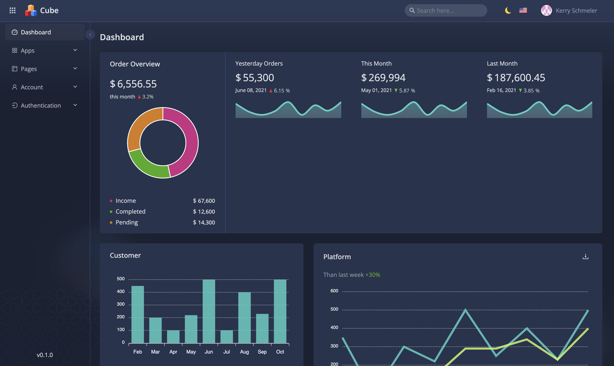
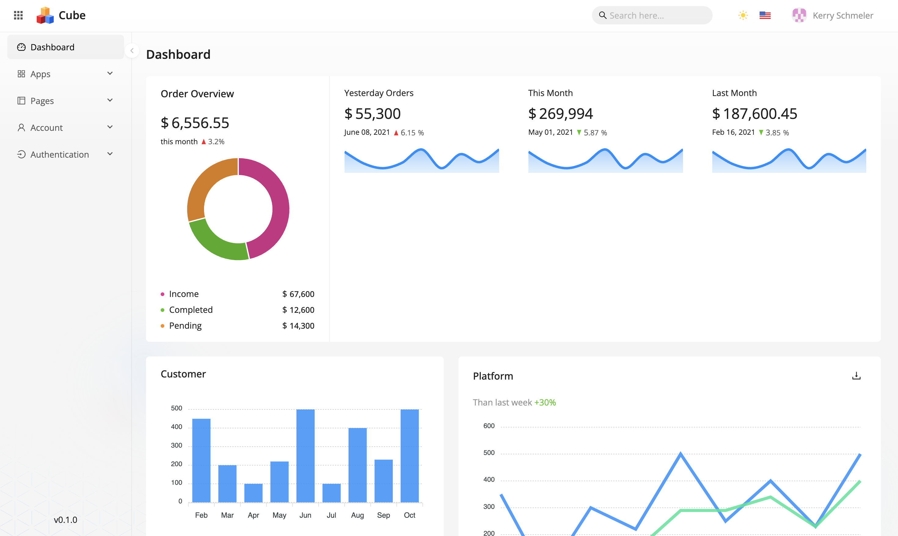

# Cube Dashboard

React-powered **100% FREE** Admin Dashboard Template for building rich user interfaces significantly faster. For developers of all levels. Open-source and maintained by the [codingjourney.site](https://codingjourney.site).

<p align="center">
    
</p>
<p align="center">
    
</p>

<!-- ### Demo
Check out a [live demo](). -->

## Key Features
- 🚀 This solution allows you to reduce MVP development costs by up to 50%
- 🐜 Cube admin dashboard template is based on a rich library powered by [Ant Design](https://ant.design)
- 💰 100% Free: start using it for your projects right away. No hidden payments, no trials, nothing
- 💻 Any backend supported: the dashboard supports any kind of backend by just updating an API
- ⭐ Modern & great for projects of tomorrow: built with [React](https://reactjs.org/), [React Query](https://tanstack.com/) and [Ant Design](https://ant.design/) 100% free
- 📱 Mobile first: optimized to reduce data usage on mobile devices
- 🔥 Responsive & adaptive: supports mobile, tablet, and desktop screens
- ☎️ Supports PWA to get all advantages of native mobile apps
- 🎨 Theming: use built-in light and dark themes or implement your own theme with just lines of code
- 🌓 Day & night mode: dark theme is automatically activated
- 🏋️ Optimized bundle size: use the latest features of building tools to reduce the final bundle size

## Under the Hood
- 🚄 All-set business flow: login, sign up, forgot password, profile, setting, CRUD flows
- 🗞️ Built-in apps: Billing, File Manager
- 👍 Fully typescripted
- ✅ Clean code: enjoy the world-recognized code style with our own enhancements
- 🧱 Solid architecture: in compliance with the  best architectural practices

### Installation

#### Requirements
- [Node.js](https://nodejs.org/en/) version _>=20.0.0_
- [yarn](https://yarnpkg.com/) _>=4.0.0_

#### To go with the latest version please copy and past in your terminal the following steps

```bash
git clone https://github.com/jocelynTV/cube-ant-design-dashboard cube-ant-design-dashboard && cd cube-ant-design-dashboard
```

Development mode
```
yarn install && yarn start
```

Production mode
```
yarn install && yarn build
```


### How you can give a shout-out to us

- ⭐ Star our GitHub repo
- 🐞 Create requests, submit bugs, suggest new features